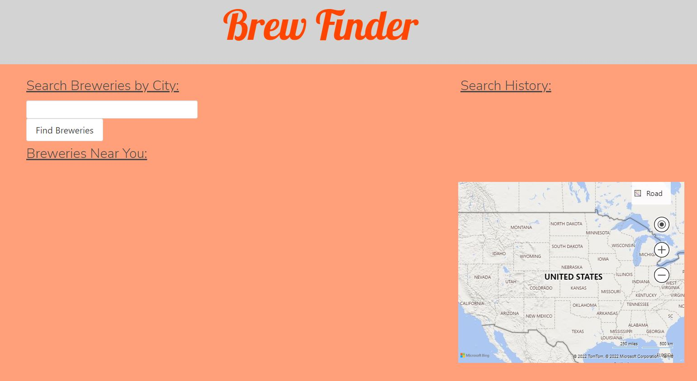

# Brew Finder - Find Breweries!

## Description

In need of a date night? In a new city? Wanting to try something new? Look no further than Brew Finder, a helpful website to direct you to breweries near you. 

## Installation

N/A

## Usage

Brew Finder is a very easy to use website for any beer enthusiast. Just input the city you are wanting to find a brewery in and a list of breweries will populate for that city. The map will use push pins to show you the locations of the breweries in the city you searched for. The simplicity of Brew Finder means it is all about the beer and will help you find a great date night spot, your new favorite hang out or to check off a place on your brewery passport. 

## Link To Deployed Webpage:

[Brew Finder Deployed Site](https://jaspersonja.github.io/brewfinder/)

## Future Development:

In the next steps the Brew Finder team plans to add the option to narrow down your search by a specific type of brewery (ex - micro-breweries) and the breweries reviews. We also plan to add the ability to get directions straight from the Brew Finder site.

## Credits:

[@jaspersonja](https://github.com/jaspersonja)  
[@kkaiser101](https://github.com/kkaiser101)  
[@shannonpuno](https://github.com/shannonpuno)  
[@isabella-pettini](https://github.com/isabella-pettini)  

## License:
Please refer to the LICENSE in the repo.